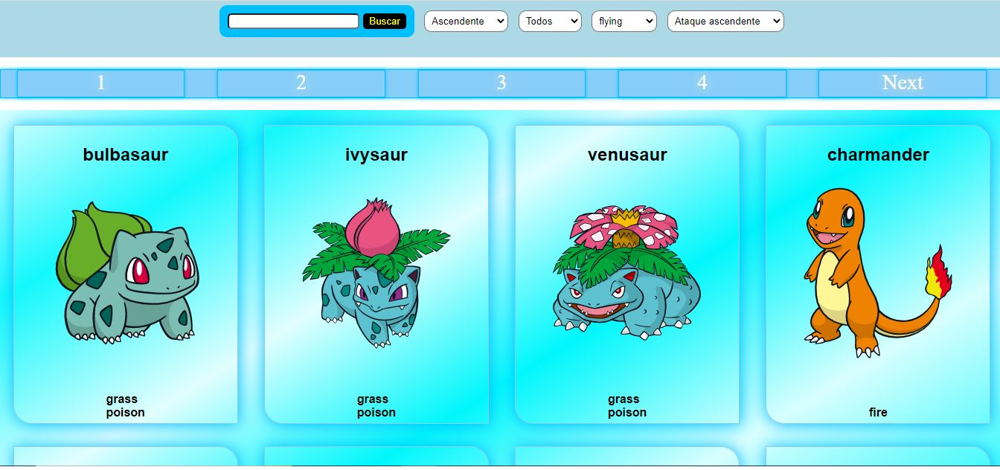

# Hola, soy Omar 👍

Soy Full Stack Web Developer, me gusta la programacion ya que es un mundo muy amplio donde siempre hay algo nuevo que aprender

# 🧑‍💻 Tecnologías

# 🛠 Proyectos
## PI-Pokemon
Aplicacion para poder buscar, crear, eliminar y actualizar pokemones,
tecnologias usadas: 
Javascript | HTML | CSS | React | Redux | Node | Sequelize | PostgreSQL

## PI-Food
Aplicacion para poder buscar, crear, eliminar y actualizar recetas,
tecnologias usadas: 
Javascript | HTML | CSS | React | Redux | Node | Sequelize | PostgreSQL

## PF-E-commerce
Poyecto final grupal, app para la venta de torteras
tecnologias usadas: 
Javascript | HTML | CSS | React | Redux | Node | Sequelize | PostgreSQL | Firebase

## 🔗 Links

